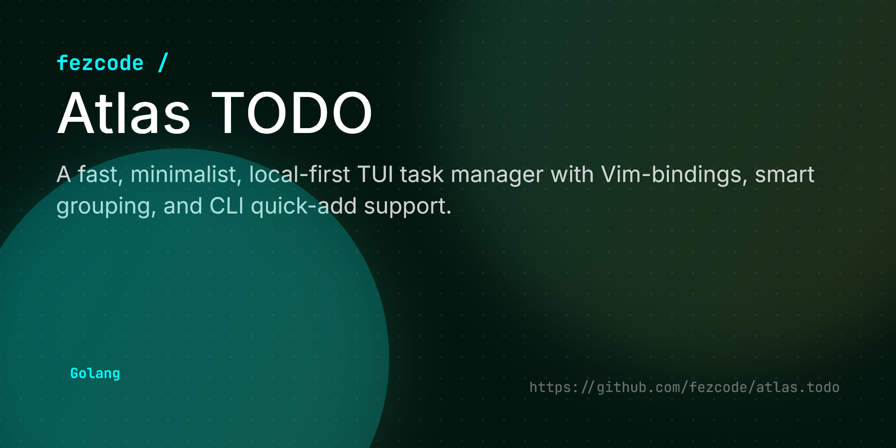

# Atlas Todo



**atlas.todo** is a fast, keyboard-centric terminal user interface (TUI) for task management. Part of the **Atlas Suite**, it helps you organize your life with local-first storage, smart grouping, and Vim-like navigation.


## ✨ Features

- 📊 **Smart Grouping:** Cycle views by Category, Day, or Priority with a single key.
- ⌨️ **Vim Bindings:** Navigate, edit, and move tasks without leaving the keyboard.
- 🏷️ **Metadata Parsing:** Add `@category` or `!priority` (!high, !med, !low) directly in the task title.
- 🔍 **Real-time Search:** Filter tasks instantly as you type.
- 💾 **Local First:** Your data lives in `~/.atlas/todo.json`—no cloud, no latency.
- 📦 **Cross-Platform:** Binaries available for Windows, Linux, and macOS.

## 🚀 Installation

### From Source
```bash
git clone https://github.com/fezcode/atlas.todo
cd atlas.todo
go build -o atlas.todo .
```

## ⌨️ Usage

Simply run the binary to enter the TUI:
```bash
./atlas.todo
```

### CLI Quick Add
Add a task without opening the UI (ensure you use quotes for tasks with metadata):
```bash
./atlas.todo add "Finish the report @work !high"
```

### CLI List Mode (MOTD)
Display your top tasks and exit. Perfect for your shell's startup script.

```bash
# Show 5 tasks (default)
./atlas.todo list

# Show 3 tasks
./atlas.todo list 3

# Show top 5 high-priority tasks
./atlas.todo list desc 5
```

### Shell Integration
You can add `atlas.todo list` to your shell profile to see your tasks every time you open a terminal.

**Bash (`~/.bashrc`) or Zsh (`~/.zshrc`):**
```bash
# Add to the end of your config file
/path/to/atlas.todo list desc 5
```

**PowerShell (`$PROFILE`):**
```powershell
# Add to the end of your profile script
& "C:\path\to\atlas.todo.exe" list desc 5
```

**Fish (`~/.config/fish/config.fish`):**
```fish
# Add to the end of your config file
/path/to/atlas.todo list desc 5
```

### ✨ Pro Tip: Advanced Shell Dashboard
Want a more "alive" terminal? Use one of the dashboard scripts for a personalized greeting, a custom ASCII banner, and color-coded task highlighting.

#### Bash/Zsh (`dashboard.sh`)
You can use the [dashboard.sh](./dashboard.sh) script in your `~/.bashrc` or `~/.zshrc`:

```bash
# Add this to your shell profile
source /path/to/atlas.todo/dashboard.sh
```

#### PowerShell (`dashboard.ps1`)
You can use the [dashboard.ps1](./dashboard.ps1) script in your `$PROFILE`:

```powershell
# Add this to your $PROFILE
. C:\path\to\atlas.todo\dashboard.ps1
```

## 🕹️ Controls

| Key | Action |
|-----|--------|
| `↑/↓` or `k/j` | Navigate tasks |
| `Space` | Toggle task completion |
| `n` | Create a new task |
| `/` | Search/Filter tasks |
| `g` | Cycle grouping (None, Category, Day, Priority) |
| `s` | Cycle sorting (Default, Asc ↑, Desc ↓) |
| `c` | Toggle showing completed tasks |
| `d` | Delete task (requires confirmation) |
| `q` or `Esc` | Quit |

## 🏗️ Building for all platforms

The project uses **gobake** to generate binaries for all platforms:

```bash
gobake build
```
Binaries will be placed in the `build/` directory.

## 📄 License
MIT License - see [LICENSE](LICENSE) for details.
